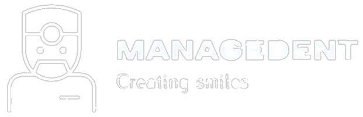

# ManageDent
This web application efficiently manages dental clinic operations, including appointments, staff, patients, and equipment. It features detailed procedure reports, specialty-based patient-dentist matching, and a secure, role-based login system. Built with PHP, HTML, CSS, and SQLite, the system leverages UML for structural design.

## Getting Started
Please see [0.get_started.md](docs/0.get_started.md). The following documents are also provided for your reference:
- [System Overview](docs/1.system_overview.md)
- [Database Model](docs/2.database_model.md)

## Contributions

This project was developed by three individuals. Special thanks to the following contributors: 
- [Diogo Bastos](https://github.com/diogobastos07) 
- [Bárbara Teixeira](https://github.com/babateixeira) 
- [José Queirós](https://github.com/josequeiros27) 

Feel free to explore and contribute to our project! 🚀
